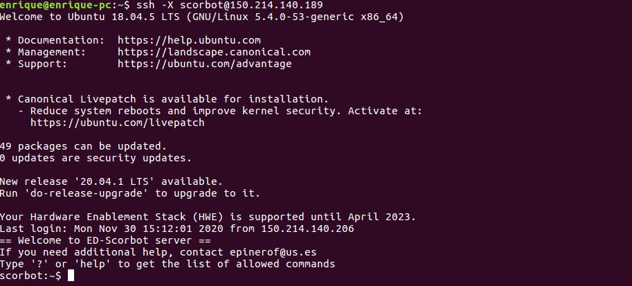

# Establish connection

## Linux 

1. Create public/private keypair (for ssh connection)
    * ```ssh-keygen -f <key_name>```
        * Enter password if desired
    
    You will get two different files named <key_name> and <key_name>.pub in the directory you run the command in

2. Send an e-mail to epinerof@us.es specifying the following information:
    * Full name 
    * Name of your organization
    * Public key (<key_name>.pub file) attached
    * Preferred username (optional)

    Once you've done this step, you will have to wait to receive a confirmation e-mail from the server's administrator.

3. Upon receiving the confirmation e-mail, you will already have your user created (you will receive a username in case you didn't specify one in the e-mail) and ready to go. So, in order to establish the connection execute the following command:

    * ```ssh -X -i /path/to/private/key/<key_name> <username>@150.214.140.189```

    If everything went correctly, you should have access to a terminal like this in your screen:

    
    

4. Check everything runs fine by executing the GUI of the service:
    * ```cd pyAER```
    * ```python3 main.py```

    A window like this should open in your PC:

    

    Check the bottom left checkbox that says "Open device", then look at the terminal where you have the active connection. If the message "*Device found and initialized successfully*" is displayed, you have successfully connected to the server and everything is ready for you to begin.

## Windows
1. Create public/private keypair (for ssh connection)
    * Download and install puTTY client ([official website](https://www.chiark.greenend.org.uk/~sgtatham/putty/latest.html))
    * Run puTTYgen utility (it is installed with puTTY). A window like this should appear:
    
2. Send an e-mail to epinerof@us.es specifying the following information:
    * Full name 
    * Name of your organization
    * Public key (<key_name>.pub file) attached
    * Preferred username (optional)

    Once you've done this step, you will have to wait to receive a confirmation e-mail from the 
    server's administrator.
3. Upon receiving the confirmation e-mail, you will already have your user created (you will receive a username in case you didn't specify one in the e-mail) and ready to go. However, you will need to install the Xming software as well as configure puTTY in order for you to be able to use the X11 utilities (otherwise you can't use the graphical interface).

1. INSTRUCCIONES PARA:
    1. GENERAR CLAVES CON PUTTY
    2. INSTALAR XMING
    3. CONFIGURAR PUTTY PARA QUE UTILICE EL XMING

# Scorbot use tutorial with Scorbot Server

*NOTE: It is important to note that this access is quite limited, so that you only may perform certain activities. However, if you need to use any command or utility that isn't available out of the box, contact epinerof@us.es with your requests.*

## Prepare the session

First of all, each joint of the robot has to be positioned in its home area (home in this robot isn't just one position but a range of them). So for us to work with it, before anything we do we have to command the robot to send all of its joints to their home.

In order to do that, there is a function called ```Search_Home``` that implements said process, starting from the 1st joint (a.k.a. the base) up to the 4th one. This will take a while, as each joint is sent to one of its limit positions and then progressively moves in the opposite direction searching for its home.

The ```Search_Home``` function is an all-in-one button in the GUI as well as in the code itself; however, there are also separate functions, called ```search_Home_JX``` (where ```X``` is the joint number), that are callable from the code that implement this functionality but for just one joint. Each of these functions also has its corresponding button in the GUI for convenience. 

So, to sum it all up, any time that anyone has to work with the robot, the first thing to do is to command it to search the home position for all of its joints, whether it is via the ```Search_Home``` button or function or via the ```search_Home_JX``` buttons or functions.

NOTE: ```search_Home_JX``` functions should be used in case one of the joints is suspected to have lost its home reference, so that you don't have to wait for all joints to search their home in case just one of them has gone astray.

## Understanding references

In order to make this section a little bit more understandable, let's take a look at the graphical interface first:

