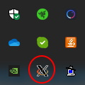
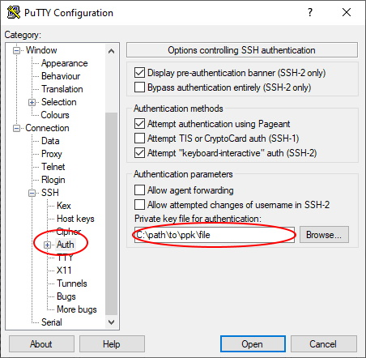
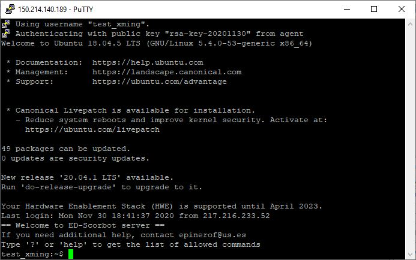

# Index

1. [Establish connection](#Establish-connection)
    1. [Linux](#Linux)
    2. [Windows](#Windows)
2. [Scorbot use tutorial with Scorbot Server](#Scorbot-use-tutorial-with-Scorbot-Server)
    1. [Prepare the session](#Prepare-the-session)
        * [TL;DR](#TL;DR-Too-long-didn't-read)
    2. [Understanding references](#Understanding-references)
    3. [How to make the robot move](#How-to-make-the-robot-move)
        * [TL;DR](#TL;DR)
    4. [Coding](#Coding)
    5. [Camera(s) use](#Camera(s)-use)
3. [Frequently Asked Questions](#FAQ)

# Establish connection

## Linux 

1. Create public/private keypair (for ssh connection)
    * ```ssh-keygen -f <key_name>```
        * Enter password if desired
    
    You will get two different files named <key_name> and <key_name>.pub in the directory you run the command in

2. Send an e-mail to epinerof@us.es specifying the following information:
    * Full name 
    * Name of your organization
    * Public key (<key_name>.pub file) attached
    * Preferred username (optional)

    Once you've done this step, you will have to wait to receive a confirmation e-mail from the server's administrator.

3. Upon receiving the confirmation e-mail, you will already have your user created (you will receive a username in case you didn't specify one in the e-mail) and ready to go. So, in order to establish the connection execute the following command:

    * ```ssh -X -i /path/to/private/key/<key_name> <username>@150.214.140.189```

    If everything went correctly, you should have access to a terminal like this in your screen:

    
    

4. Check everything runs fine by executing the GUI of the service (please be patient when using the GUI because it can take a little while to respond):
    * ```cd pyAER```
    * ```python3 main.py```

    A window like this should open in your PC:

    

    Check the bottom left checkbox that says "Open device", then look at the terminal where you have the active connection. If the message "*Device found and initialized successfully*" is displayed, you have successfully connected to the server and everything is ready for you to begin. 
    
    [Device not found troubleshooting](#When-I-check-the-"Open-device"-checkbox-a-message-box-that-says-"Device-not-found,-try-again-or-check-the-connection"-is-displayed)

## Windows
1. Create public/private keypair (for ssh connection)
    * Download and install PuTTY client ([official website](https://www.chiark.greenend.org.uk/~sgtatham/putty/latest.html))

    * Run PuTTYgen utility (it is installed with PuTTY). A window like this should appear:
        
        

    * Now click on the button that says "Generate". The program will need you to move your mouse around the blank area, so just do as it says. Once that is out of the way, you will have generated your keypair and the window should look like this:

        

    * Now save both private and public keys by clicking on the buttons that say so. You may also enter a passphrase for your key, which is recommended but optional. You may now close PuTTYgen 

    * Once you've saved both keys, you'll have two files: <key_name>.pub and <key_name>.ppk. At this point, you've finished generating the private and public key required.

2. Send an e-mail to epinerof@us.es specifying the following information:
    * Full name 
    * Name of your organization
    * Public key (<key_name>.pub file) attached
    * Preferred username (optional)

    Once you've done this step, you will have to wait to receive a confirmation e-mail from the server's administrator. Upon receiving the confirmation e-mail, you will already have your user created (you will receive a username in case you didn't specify one in the e-mail) and ready to go. However, you will need to install the Xming software as well as configure PuTTY in order for you to be able to use the X11 utilities (otherwise you can't use the graphical interface).  

3. Install Xming software ([official website](https://sourceforge.net/projects/xming/))
    * During the installation process, you may select the option "Don't install an SSH client", as you have already installed PuTTY: 

        You can just use the default configuration for everything else.

4. Run Xming
    * Executing the software will make a small "X" icon appear in your tray bar:

        
    
        This means Xming is being executed. 
5. Configure PuTTY connection
    * Open PuTTY and create a new session named however you want. This is recommended so that you only have to perform these steps once and after that the connection is as simple as double-clicking the session you've created.
    
    * Under "Host Name (or IP address)" type the following: ```<username>@150.214.140.189```

    * Uncollapse the "SSH" section under "Connection" in the tree view that's in the left side of the program. Now select "X11" and check the box that says "Enable X11 forwarding". In the input box that says "X display location" enter "localhost:0.0".

         
    
    * Now select the "Auth" section that is also under "Connection". The last option displayed lets you select a private key file. Click on "browse" and select the <key_name>.ppk file that you generated earlier.

         

    * Return to the session view by clicking on the "Session" section that is the first one in the tree view and save your session. 
    
6. Now all you have to do is double-click on your connection's name and you will be connected to the server with your username. A window like this should appear before you: 

    


7. Last, but not least, you should check that the Xming X server is working correctly, as well as test your configuration by doing the following:
    
    * ```cd pyAER```
    * ```python3 main.py```

    A window similar to this one should appear (please be patient, from now on it can take a while to load):
    

    You just have one more thing to check, and you can do that by checking the bottom left checkbox that says "Open device". If a message that says "*Device found and initialized successfully*" is displayed in the PuTTY console, then you're ready to begin.


# Scorbot use tutorial with Scorbot Server

*NOTE: It is important to note that this access is quite limited, so that you only may perform certain activities. However, if you need to use any command or utility that isn't available out of the box, contact epinerof@us.es with your requests.*

## Prepare the session

First of all, each joint of the robot has to be positioned in its home area (home in this robot isn't just one position but a range of them). So for us to work with it, before anything we do we have to command the robot to send all of its joints to their home.

In order to do that, there is a function called ```Search_Home``` that implements said process, starting from the 1st joint (a.k.a. the base) up to the 4th one. This will take a while, as each joint is sent to one of its limit positions and then progressively moves in the opposite direction searching for its home.

The ```Search_Home``` function is an all-in-one button in the GUI as well as in the code itself; however, there are also separate functions, called ```search_Home_JX``` (where ```X``` is the joint number), that are callable from the code that implement this functionality but for just one joint. Each of these functions also has its corresponding button in the GUI for convenience. 

So, to sum it all up, any time that anyone has to work with the robot, the first thing to do is to command it to search the home position for all of its joints, whether it is via the ```Search_Home``` button or function or via the ```search_Home_JX``` buttons or functions, and after that you have to use the ```Configure_Init``` button so that the home position is considered the initial one.

### **TL;DR** (Too long, didn't read)

Just click on the ```Search_Home``` button before anything else and let it finish, then push the ```Configure_Init``` and ```Configure_SPID``` buttons in the specified order when initiating a new work session and you should be fine.

NOTE: ```search_Home_JX``` functions should be used in case one of the joints is suspected to have lost its home reference, so that you don't have to wait for all joints to search their home in case just one of them has gone astray.

## Understanding references

In order to make this section a little bit more understandable, let's take a look at the graphical interface first:


As you can see, each motor has 6 different parameters and almost all of them are used to determine how it should move. However, if you're only interested in actually moving them and not in how they move you're lucky, because you're only going to need one of these parameters, and that would be the ```ref_MX``` one.

So what does exactly this "reference" mean? You can think of it as a way of telling each motor the position it should be in. For example, the reference "0" would be the motor's initial position (which should be the home position if you followed the steps under the "Prepare the session" section), then any positive reference would send the motor in one direction and any negative reference would send it in the opposite one.

And that's everything you need to know if you're only interested in moving the robot. As for how to map references to angles, we're providing you with some functions in the code to help you with that, as that kind of mapping is specific to each robot and to each motor within a given robot. That's right, a reference of say, 50, can put the first motor in an angle ```alpha``` but the second motor in another completely different angle ```beta```, so it's best if you just adhere to the mappings we offer you.


## How to make the robot move

So now that the concept of reference has been explained, we can move on to moving the robot. As it has been said, the only important parameter here would be the reference, so you can rest easy knowing that all of the other parameters won't have to be changed, at least from a user's point of view. 

Therefore, in order to move the robot you have to first do the actions specified in the "Prepare the session section". Then, there are a couple of different ways to move the joints. The preferred and recommended way is to just use ```SendCommandJointX_lite``` functions, as they only send the minimal required information to the controller in order for the movement to be performed. The ```Configure_SPID``` function can also be used to update references (and thus moving the robot) but the issue here is that it doesn't only send the updated reference but it also sends everything else, so understand that when calling this function you're sending every parameter to every joint, so don't expect the performance to be as good as if you were using ```SendCommandJointX_lite``` functions.

### TL;DR

In order to move the robot, you have to hit ```Configure_SPID``` at least once after the initial setup (described [here](#Prepare-the-session)) and then use the ```Send JX ref``` buttons (within the GUI) or ```SendCommandJointX_lite``` functions within the code.

```Configure_SPID``` can also be used to update references, but it is far slower than using ```SendCommandJointX_lite``` functions, so using the latter method is recommended.

## Coding

So, the graphical interface is nice and all, however, we understand that it is not suitable to be used when the robot is intended to be moved in a programatically way, for example, with a Spiking Neural Network, as we don't expect the network to handle the robot's movement the same way we do.

Therefore, the same functions and variables that are bound to the buttons in the graphical interface are also accessible within the code, what means that all you have to do in order to use them is import the main module and use it just like any other Python module.

A small demo script can be found [here](./demo.py). 

Summarizing, the functions you really want to use are:
* ConfigureInit() -- Once at the beginning of the session, before searching home locations
* ConfigureSPID() -- Once after searching home locations, so that the robot stays in those
* SendCommandJointX_lite -- These functions send each joint its reference and nothing else, so that you only send the required information for movement

And last, but not least, you should be able to modify each joint's reference by modifying the variables that hold them in the graphical interface, as these variables are also accesible from the code. 

The dictionary that holds all the variables is called `d` and is accesible directly from an object of the class pyAER. The structure of the dictionary is as follows:
```python
d
{
    Motor Config
    {
        "EI_FD_bank3_18bits_M1": ...,
        "PD_FD_bank3_22bits_M1": ...,
        "PI_FD_bank3_18bits_M1": ...,
        "leds_M1": ...,
        "ref_M1": ...,
        "spike_expansor_M1": ...,
        "EI_FD_bank3_18bits_M2"...,
        ...
        "spike_expansor_M6"
    }
    Joints
    {
        ... 
    }
    Scan Parameters
    {
        ...
    }
}
```

Each of these values is a Tkinter variable, so in order to read or write its value you have to do it like this:

```python
ref = d["Motor Config"]["ref_M1"].get() #Read
d["Motor Config"]["ref_M1"].set(50) #Write
```

You can also bind the internal dictionaries to other variable so that you don't have to continuously write ```d["Motor Config]["ref_MX"]``` or such:

```python
motors = d["Motor Config"]
#Same as ref = d["Motor Config"]["ref_M1"].get()
ref = motors["ref_M1"].get() #Read

#Same as d["Motor Config"]["ref_M1"].set(50) 
motors["ref_M1"].set(50) #Write
```

Don't worry if you find this confusing, as the demo script contains instructions that use and modify these variables
## Camera(s) Use

### WARNING: This section will change in the near future


There are a couple of cameras setup in the laboratory, so that you may see how the robot is moving during the work sessions. 

You may open the cameras with the following command:

```bash
python3 utils/camera1.py & #Add ampersand to execute in background
python3 utils/camera2.py &
```

Provided that you are in your home directory. As you can see, `camera1.py` and `camera2.py` are located within the directory `utils`. 

These commands should be executed before opening the graphical interface or running any script, or in a separate shell that one that is running those.

In order to close the camera's windows, just click on the window you want to close and hit the escape key ('Esc') on the keyboard.

# FAQ 


## When I check the "Open device" checkbox a message box that says "Device not found, try again or check the connection" is displayed
## When I execute the `checkUSB()` method with the `checked` variable set to `True` I get a message that says "Device not found, try again or check the connection"


There is nothing wrong with this, it normally means that the robot is not powered. This shouldn't happen during a scheduled work session, so it should typically occur when you're trying to check whether the GUI or scripting environment works for you or not. 

## What are the parameters that are not "ref_MX" for?

These parameters are used to control the SPID (Spiking PID) of each joint, and they are already configured for this robot. You shouldn't be touching these unless you really know what you're doing. For more information, please refer to this paper: [A Neuro-Inspired Spike-Based PID Motor Controller for Multi-Motor Robots with Low Cost FPGAs](https://www.mdpi.com/1424-8220/12/4/3831/htm)